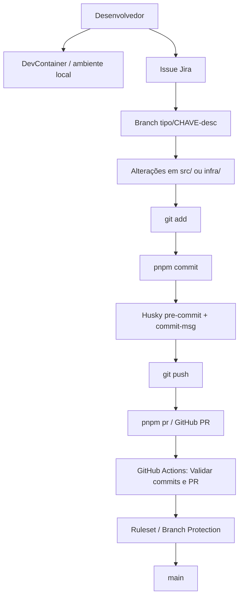
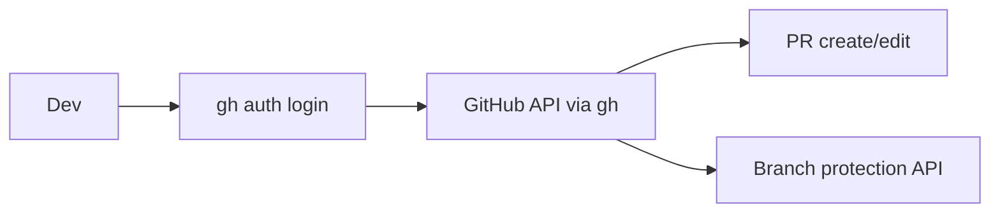
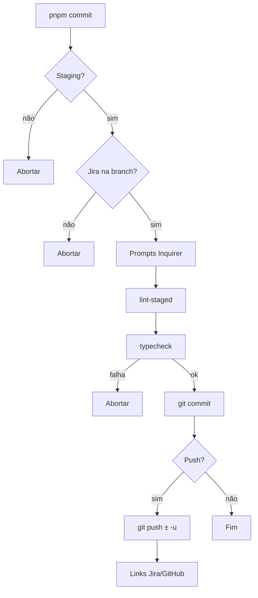
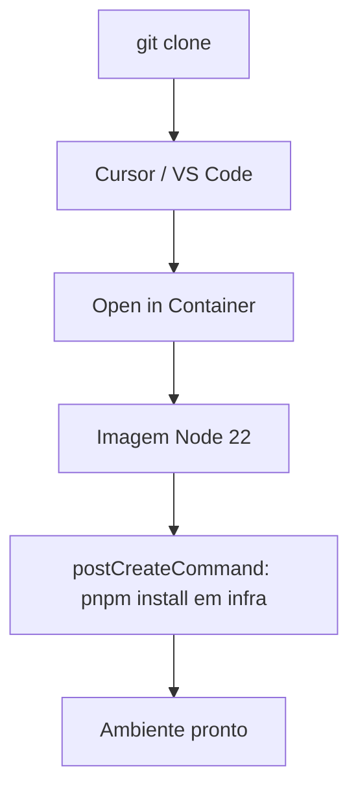
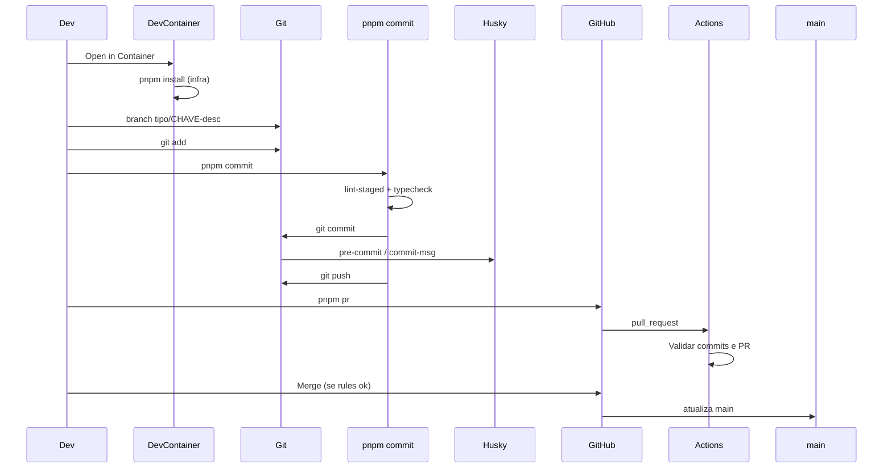

# Arquitetura e fluxos — Engineering Platform (`devcontainer-integration`)

Arquivo: `infra/docs/arquitetura-e-fluxos.md`

> Onde algo não pôde ser confirmado no código, está marcado como **Não confirmado no código atual.**

---

## Como interpretar esta documentação

Esta documentação separa o que **já existe** no projeto do que está **planejado para o futuro**.

Quando houver diferença entre documentação e configuração real, considere como referência principal os arquivos que **realmente executam** a regra — scripts, workflows, hooks e arquivos de configuração.

Exemplo: se um README disser que o commit pode ter 120 caracteres, mas o `commitlint.config.js` limitar a 100, vale **100**.

Se no futuro a empresa tiver uma regra geral e um projeto precisar de uma regra diferente, a regra **daquele projeto** pode valer só nele (ex.: empresa em Node 22, projeto legado em Node 20).

### O que este repositório é

`devcontainer-integration` **não** é uma aplicação comum para cliente (site, API, login, banco, sistema de vendas).

É uma **base de desenvolvimento** (Engineering Platform) para padronizar:

- commit, branch e Pull Request;
- DevContainer;
- GitHub Actions;
- chave Jira;
- lint e typecheck.

### O que existe hoje

Atualmente a Engineering Platform possui:

- DevContainer padronizado;
- integração Git + Jira por chave;
- `pnpm commit`;
- Husky;
- Commitlint;
- lint-staged;
- ESLint;
- Prettier;
- typecheck;
- criação de Pull Request via `pnpm pr`;
- GitHub Actions;
- proteção da branch `main`.

### O que está planejado para o futuro

Ainda estão previstos:

- Cursor integrado ao conhecimento da empresa;
- Obsidian corporativo;
- integração direta do Cursor com Jira;
- integração ampliada do Cursor com GitHub;
- provisionamento automático de projetos;
- gerenciamento centralizado de secrets.

Esses itens futuros **não** devem ser considerados funcionalidades já implementadas.

---

## Índice

> Links abaixo são **âncoras relativas** do Markdown (`#secao`). No GitHub/Notion funcionam neste arquivo.
> No preview do VS Code/Cursor o href pode aparecer como `vscode-resource://...` — isso é do editor, não está gravado no arquivo.

1. [Como interpretar esta documentação](#como-interpretar-esta-documentação)
2. [Visão geral](#1-visão-geral-da-aplicação)
3. [Estrutura do repositório](#2-estrutura-completa-do-repositório)
4. [Tecnologias](#3-tecnologias-utilizadas)
5. [Como executar](#4-como-executar-a-aplicação)
6. [Portas](#5-portas)
7. [Frontend](#6-frontend)
8. [Backend](#7-backend)
9. [Rotas da API](#8-todas-as-rotas-da-api)
10. [Modelos e tipos](#9-modelos-e-tipos)
11. [Banco de dados](#10-banco-de-dados)
12. [Variáveis de ambiente](#11-variáveis-de-ambiente)
13. [Autenticação e autorização](#12-autenticação-e-autorização)
14. [Integrações externas](#13-integrações-externas)
15. [Jira](#14-jira)
16. [Git](#15-git)
17. [Ferramenta de commit](#16-ferramenta-de-commit)
18. [Husky](#17-husky)
19. [Commitlint](#18-commitlint)
20. [lint-staged](#19-lint-staged)
21. [TypeScript / typecheck](#20-typescript--typecheck)
22. [Pull Request](#21-pull-request)
23. [GitHub Actions](#22-github-actions)
24. [Branch Protection / Ruleset](#23-branch-protection--ruleset)
25. [DevContainer](#24-devcontainer)
26. [Docker](#25-docker)
27. [Cursor](#26-cursor)
28. [VS Code](#27-vs-code)
29. [Testes](#28-testes)
30. [Tratamento de erros](#29-tratamento-de-erros)
31. [Logging](#30-logging)
32. [Segurança](#31-segurança)
33. [Dependências](#32-dependências)
34. [Fluxo completo do sistema](#33-fluxo-completo-do-sistema)
35. [Fluxo de desenvolvimento de uma tarefa](#34-fluxo-de-desenvolvimento-de-uma-tarefa)
36. [Onboarding de um desenvolvedor novo](#35-onboarding-de-um-desenvolvedor-novo)
37. [Troubleshooting rápido](#36-troubleshooting-rápido)
38. [Rollback e manutenção](#37-rollback-e-manutenção)
39. [Definition of Done](#38-definition-of-done-critério-de-conclusão)
40. [Onde alterar cada coisa](#39-onde-alterar-cada-coisa)
41. [Pontos de atenção](#40-pontos-de-atenção)
42. [Lacunas identificadas](#41-lacunas-identificadas)
43. [Referências de arquivos principais](#42-referências-de-arquivos-principais)

---

## 1. Visão geral da aplicação

### Nome do projeto

- **Nome npm (`infra/package.json`):** `devcontainer-integration`
- **Versão:** `0.1.0`
- **Natureza (regra Cursor):** Engineering Platform — **não** é um sistema de negócio.

Arquivo: `.cursor/rules/engineering-platform.mdc`

### Objetivo

Padronizar e provisionar capacidades de engenharia reutilizáveis para projetos da empresa:

- commits Conventional + chave Jira;
- hooks locais (Husky, Commitlint, lint-staged, typecheck);
- CI no PR (GitHub Actions);
- Dev Container;
- scripts CLI (`pnpm commit`, `pnpm pr`, `pnpm proteger-branch`).

### Problema que resolve

Evitar que cada projeto invente seu próprio padrão de commit, CI, DevContainer e qualidade de código. Esta base serve como template/plataforma.

### Principais funcionalidades (confirmadas no código)

| Funcionalidade                              | Onde                                          |
| ------------------------------------------- | --------------------------------------------- |
| Commit interativo                           | `infra/scripts/commit.mjs` via `pnpm commit`  |
| Abertura/atualização de PR                  | `infra/scripts/abrir-pr.mjs` via `pnpm pr`    |
| Proteção da branch principal (API clássica) | `infra/scripts/proteger-branch-principal.mjs` |
| Validação Jira no CI                        | `.github/workflows/validar-jira-key.yml`      |
| Lint / format / typecheck                   | ESLint, Prettier, `tsc`                       |
| Exemplo mínimo de app em `src/`             | `src/index.js`, `src/saudacao.js`             |

### Usuários envolvidos

| Perfil        | Uso                                                                     |
| ------------- | ----------------------------------------------------------------------- |
| Desenvolvedor | `readme-commit.md`, `pnpm commit`, `pnpm pr`, código em `src/`          |
| DevOps        | `infra/`, DevContainer, CI, `pnpm proteger-branch`, bootstrap da `main` |

### Componentes principais

```text
Raiz (área do projeto cliente)
  ├── src/                 # código de exemplo / futuro app
  ├── package.json         # scripts + lint-staged (raiz)
  └── .husky/              # hooks Git

infra/                     # automação e configs da plataforma
  ├── scripts/             # commit, PR, proteção
  ├── config/              # commitlint, tsconfig, prettier, jira
  └── docs/                # documentação

GitHub
  ├── Actions (CI)
  └── Branch rules (externo)
```

### Fluxo geral



**Não confirmado no código atual:** API HTTP de negócio, dashboard web, workers, provisionamento automático de Trello/Jira/GitHub além dos scripts CLI listados.

---

## 2. Estrutura completa do repositório

### Árvore simplificada

```text
.
├── .cursor/rules/                 # regras Cursor (Engineering Platform + commits)
├── .devcontainer/devcontainer.json
├── .github/workflows/validar-jira-key.yml
├── .husky/pre-commit
├── .husky/commit-msg
├── .vscode/settings.json
├── .env.example
├── .gitignore
├── eslint.config.js               # ESLint (base path = raiz)
├── package.json                   # scripts raiz + lint-staged
├── readme-commit.md               # guia do desenvolvedor
├── devcontainer-integration.infra.code-workspace
├── src/
│   ├── index.js
│   ├── saudacao.js
│   └── README.md
└── infra/
    ├── package.json
    ├── pnpm-lock.yaml
    ├── README.md
    ├── config/
    │   ├── commitlint.config.js
    │   ├── eslint.config.js       # reexporta eslint da raiz
    │   ├── jira.json
    │   ├── prettier.config.json
    │   ├── prettierignore
    │   └── tsconfig.json
    ├── docs/
    │   ├── README.md
    │   ├── pipeline-devops.md
    │   ├── devcontainer.md
    │   ├── arquitetura-e-fluxos.md  # este arquivo
    │   └── specs/*.pdf
    └── scripts/
        ├── commit.mjs
        ├── abrir-pr.mjs
        ├── git-jira-utils.mjs
        └── proteger-branch-principal.mjs
```

Pastas **não** existentes neste repo (procuradas e ausentes): `tests/`, `public/`, `config/` na raiz, `Dockerfile`, `docker-compose`.

### Pastas importantes

| Pasta / arquivo      | Finalidade                                                       | Quem usa                  | Alterar com cuidado              |
| -------------------- | ---------------------------------------------------------------- | ------------------------- | -------------------------------- |
| `src/`               | Exemplo mínimo de aplicação; coberto por lint-staged e typecheck | Dev                       | Livre para evoluir o app         |
| `infra/scripts/`     | CLIs da plataforma                                               | DevOps / todos via `pnpm` | Sim — afeta todos os commits/PRs |
| `infra/config/`      | Configs empresa                                                  | DevOps                    | Sim — padrão da empresa          |
| `infra/docs/`        | Documentação                                                     | Todos                     | Docs ok; PDFs = spec             |
| `.husky/`            | Hooks Git                                                        | Automático no commit      | Sim                              |
| `.github/workflows/` | CI                                                               | GitHub Actions            | Sim                              |
| `.devcontainer/`     | Ambiente padrão                                                  | Dev ao abrir container    | Sim                              |
| `.cursor/rules/`     | Instruções persistentes do Agent                                 | Cursor                    | Sim                              |
| `.vscode/`           | Visão Explorer DEV vs Infra                                      | Dev                       | Preferências locais do time      |

---

## 3. Tecnologias utilizadas

| Tecnologia        | Versão                                                           | Onde configurada                                         | Uso                                |
| ----------------- | ---------------------------------------------------------------- | -------------------------------------------------------- | ---------------------------------- |
| Node.js           | Imagem DevContainer: **22**; runtime local observado pode variar | `.devcontainer/devcontainer.json` (`javascript-node:22`) | Runtime dos scripts e `src/`       |
| pnpm              | Gerenciado via Corepack/ambiente (lock em `infra/`)              | `postCreateCommand`, scripts                             | Instalar deps de `infra/`          |
| JavaScript (ESM)  | `"type": "module"`                                               | `package.json`, `infra/package.json`                     | Scripts e `src/`                   |
| TypeScript        | **5.9.3** (lock) / `^5.8.2` (package)                            | `infra/package.json`, `infra/config/tsconfig.json`       | `pnpm typecheck` (`checkJs` em JS) |
| ESLint            | **9.39.5** (lock) / `^9.22.0`                                    | `eslint.config.js`                                       | Qualidade JS/MJS                   |
| Prettier          | **3.9.6** (lock) / `^3.5.3`                                      | `infra/config/prettier.config.json`                      | Formatação                         |
| Husky             | **9.1.7**                                                        | `infra/package.json` `prepare`, `.husky/`                | Git hooks                          |
| lint-staged       | **15.5.2** (lock) / `^15.5.0`                                    | `package.json` (raiz)                                    | Lint só em staged                  |
| Commitlint        | CLI **19.8.1** (lock) / `^19.8.0`                                | `infra/config/commitlint.config.js`                      | Mensagem de commit                 |
| Inquirer          | **12.11.1** (lock) / `^12.4.2`                                   | `commit.mjs`                                             | Prompt interativo                  |
| Chalk             | `^5.4.1`                                                         | scripts CLI                                              | Cores no terminal                  |
| GitHub Actions    | `actions/checkout@v4`                                            | `.github/workflows/`                                     | CI                                 |
| GitHub CLI (`gh`) | Externo (não npm)                                                | `abrir-pr.mjs`, `proteger-branch-principal.mjs`          | PR e branch protection             |
| Cursor Rules      | —                                                                | `.cursor/rules/*.mdc`                                    | Orientação do Agent                |

**Não encontrados no código:** React, Vite, Express, Fastify, PostgreSQL, Prisma, Docker Compose, framework de testes.

---

## 4. Como executar a aplicação

### Pré-requisitos

- Git
- Node.js (recomendado 22, alinhado ao DevContainer)
- pnpm
- Opcional: Cursor/VS Code + Dev Containers
- Opcional: `gh` autenticado (para `pnpm pr` e `pnpm proteger-branch`)

### Clone e instalação

```bash
git clone <url-do-repo>
cd <repo>
```

**Com DevContainer:** ao abrir o container, roda automaticamente:

```text
pnpm --dir infra install --frozen-lockfile
```

Arquivo: `.devcontainer/devcontainer.json` → `postCreateCommand`

**Sem DevContainer:**

```bash
pnpm setup
```

### Exemplo de “app” em `src/`

```bash
node src/index.js
```

Saída esperada (código atual): `Ola, Engineering Platform!`

Arquivos: `src/index.js`, `src/saudacao.js`

### Build / produção

**Não confirmado no código atual:** não há script `build`, bundler nem artefato de produção.

### Scripts — `package.json` (raiz)

| Comando                | O que executa                                         | Arquivo responsável                           | Quando usar                |
| ---------------------- | ----------------------------------------------------- | --------------------------------------------- | -------------------------- |
| `pnpm setup`           | `pnpm --dir infra install --frozen-lockfile`          | `package.json`                                | Clone sem container / deps |
| `pnpm commit`          | `pnpm --dir infra commit` → `node scripts/commit.mjs` | `infra/scripts/commit.mjs`                    | Todo commit de tarefa      |
| `pnpm lint`            | ESLint em `src`, `infra/scripts`, `infra/config`      | `eslint.config.js`                            | Debug de lint              |
| `pnpm typecheck`       | `tsc --project config/tsconfig.json --noEmit`         | `infra/config/tsconfig.json`                  | Debug de tipos             |
| `pnpm format`          | Prettier em `infra/` e `../src`                       | `infra/config/prettier.config.json`           | Format manual              |
| `pnpm pr`              | `node scripts/abrir-pr.mjs`                           | `infra/scripts/abrir-pr.mjs`                  | Abrir/ajustar PR           |
| `pnpm proteger-branch` | `node scripts/proteger-branch-principal.mjs`          | `infra/scripts/proteger-branch-principal.mjs` | Provisionar proteção       |

### Scripts — `infra/package.json`

| Comando                                                               | Observação                                           |
| --------------------------------------------------------------------- | ---------------------------------------------------- |
| `commit` / `pr` / `proteger-branch` / `typecheck` / `lint` / `format` | Implementação real                                   |
| `prepare`                                                             | `cd .. && husky .husky` — instala hooks após install |

### Testes automatizados

**Não confirmado no código atual:** não há script `test` nem arquivos `*.test.*` / `*.spec.*`.

---

## 5. Portas

| Porta  | Serviço                    | Onde configurada                                                                               | Uso                                        | Exposta pelo DevContainer      |
| ------ | -------------------------- | ---------------------------------------------------------------------------------------------- | ------------------------------------------ | ------------------------------ |
| `3001` | Rotulada como **frontend** | `.devcontainer/devcontainer.json` (`forwardPorts`, `portsAttributes`); `.env.example` (`PORT`) | Forward no container; variável de exemplo  | **Sim**                        |
| `5143` | Rotulada como backend      | `.env.example` (`BACKEND_PORT`)                                                                | Documentada como porta da aplicação futura | **Não** (só no `.env.example`) |
| `5432` | Rotulada como database     | `.env.example` (`DATABASE_PORT`)                                                               | Documentada como porta de banco futuro     | **Não**                        |

**Importante:** nenhum arquivo em `src/` ou `infra/scripts/` lê `PORT` / `BACKEND_PORT` / `DATABASE_PORT` hoje.  
Não confirmado no código atual: servidor HTTP escutando essas portas.

---

## 6. Frontend

**Não existe frontend web** (React/Vue/HTML app) neste repositório.

O que existe:

- exemplo CLI/Node em `src/` (`console.log`);
- DevContainer marca a porta `3001` com label `"frontend"` como **reserva** para apps futuros.

### Rotas de frontend

| Rota | Página/Componente       | Arquivo | Função | Autenticação |
| ---- | ----------------------- | ------- | ------ | ------------ |
| —    | Nenhuma rota HTTP de UI | —       | —      | —            |

---

## 7. Backend

**Não existe backend HTTP** (Express/Fastify/etc.) neste repositório.

O “backend” operacional são **scripts Node CLI** em `infra/scripts/`, invocados por `pnpm`.

### Fluxo real dos scripts (não HTTP)

```text
Terminal / pnpm
  → node infra/scripts/*.mjs
  → child_process (git, gh, pnpm)
  → stdout / exit code
```

---

## 8. TODAS as rotas da API

Pesquisa por `app.get/post`, `router`, frameworks de API: **nenhuma rota HTTP encontrada**.

| Método | Endpoint | Controller/Handler | Arquivo | Auth | Entrada | Resposta |
| ------ | -------- | ------------------ | ------- | ---- | ------- | -------- |
| —      | —        | —                  | —       | —    | —       | —        |

**Conclusão:** não há API REST/GraphQL versionada neste repo.

---

## 9. Modelos e tipos

Não há DTOs/ORM/entidades de domínio.

Tipos relevantes (JSDoc / contratos implícitos):

| Item                                           | Arquivo                            | Descrição                          |                   |
| ---------------------------------------------- | ---------------------------------- | ---------------------------------- | ----------------- |
| `montarSaudacao(nome: string): string`         | `src/saudacao.js`                  | Função exemplo                     |                   |
| `extrairJiraKeyDaBranch(branch): string \      | null`                              | `infra/scripts/git-jira-utils.mjs` | Extrai chave Jira |
| `montarTituloPrSugerido(jira, branch): string` | `infra/scripts/git-jira-utils.mjs` | Título de PR                       |                   |
| `sincronizarPullRequest(): { titulo, acao }`   | `infra/scripts/abrir-pr.mjs`       | Cria/edita PR                      |                   |
| Config Jira `{ baseUrl }`                      | `infra/config/jira.json`           | URL base Atlassian                 |                   |

---

## 10. Banco de dados

**Não confirmado no código atual:** não há ORM, migrations, seeds, connection string em uso, nem cliente de banco.

Apenas:

- `.env.example` documenta `DATABASE_PORT=5432` como convenção futura;
- docs de DevContainer mencionam Compose como evolução possível.

---

## 11. Variáveis de ambiente

| Variável            | Obrigatória              | Onde usada                                      | Finalidade                            | Exemplo seguro         |
| ------------------- | ------------------------ | ----------------------------------------------- | ------------------------------------- | ---------------------- |
| `PORT`              | Não (só exemplo)         | `.env.example`; citada em docs                  | Porta frontend futura                 | `3001`                 |
| `BACKEND_PORT`      | Não                      | `.env.example`                                  | Porta backend futura                  | `5143`                 |
| `DATABASE_PORT`     | Não                      | `.env.example`                                  | Porta DB futura                       | `5432`                 |
| `ENV_FILE`          | Definida no DevContainer | `.devcontainer/devcontainer.json` → `remoteEnv` | Nome do arquivo env no container      | `.env`                 |
| `VISUAL` / `EDITOR` | Não                      | `commit.mjs` → `garantirEditorParaDetalhes()`   | Editor para corpo do commit           | `nano` / `vi`          |
| `STATUS_CHECK`      | Não                      | `proteger-branch-principal.mjs`                 | Sobrescreve nome do check obrigatório | `Validar commits e PR` |

Arquivo `.env` está no `.gitignore` (não versionar secrets).

**Não confirmado no código atual:** leitura de `.env` por dotenv/aplicação.

Config não-env relacionada:

- `infra/config/jira.json` → `baseUrl` (URL pública do site Jira do projeto).

---

## 12. Autenticação e autorização

Não há login de usuários da aplicação.

Autenticação existente:

| Contexto    | Mecanismo                  | Arquivo                                         |
| ----------- | -------------------------- | ----------------------------------------------- |
| GitHub CLI  | `gh auth login` (externo)  | `abrir-pr.mjs`, `proteger-branch-principal.mjs` |
| Git remotes | SSH/HTTPS do desenvolvedor | operação `git`/`gh`                             |



Roles/JWT/cookies/sessão de app: **Não confirmado no código atual.**

---

## 13. Integrações externas

### GitHub

| Campo        | Valor                                                                           |
| ------------ | ------------------------------------------------------------------------------- |
| Nome         | GitHub                                                                          |
| Objetivo     | remote git, PR, Actions, branch protection                                      |
| Arquivos     | `commit.mjs` (links), `abrir-pr.mjs`, `proteger-branch-principal.mjs`, workflow |
| Autenticação | credenciais git + `gh`                                                          |
| Chamadas     | `gh pr create/edit/view`, `gh api .../branches/.../protection`, `git push`      |
| Erros        | mensagens chalk + `process.exit(1)`                                             |

### Jira

| Campo                 | Valor                                                                 |
| --------------------- | --------------------------------------------------------------------- |
| Nome                  | Jira (Atlassian)                                                      |
| Objetivo              | rastreio via chave na branch/commit/PR; link browse após push         |
| Arquivo               | `jira.json`, `git-jira-utils.mjs`, `commit.mjs`, workflow, commitlint |
| Autenticação API Jira | **Não confirmado no código atual** (não há client Jira/API token)     |
| Chamadas              | apenas montagem de URL `${baseUrl}/browse/${jira}`                    |

### Trello / e-mail / pagamentos / cloud storage

Mencionados como visão futura na regra Engineering Platform.  
**Não confirmado no código atual** (sem implementação).

---

## 14. Jira

### Regex da chave

Confirmado em vários pontos:

```text
[A-Z]{2,10}-[0-9]+
```

| Camada            | Arquivo                                      | Observação                                        |
| ----------------- | -------------------------------------------- | ------------------------------------------------- |
| Branch (extração) | `git-jira-utils.mjs` → `JIRA_KEY_NA_BRANCH`  | Case-insensitive na branch; retorna **UPPERCASE** |
| Commitlint        | `commitlint.config.js` → `jira-key-presente` | Case-sensitive `A-Z` no `parsed.raw`              |
| CI título/commits | `validar-jira-key.yml`                       | `grep -qE "[A-Z]{2,10}-[0-9]+"`                   |

### Branch

Padrão documentado: `tipo/CHAVE-descricao-curta`  
Prefixos reconhecidos em título de PR: `feat|fix|refactor|docs|test|chore|perf|build|ci` (`PREFIXO_TIPO_BRANCH`).

### Commit

```text
tipo(escopo): CHAVE descricao
tipo(escopo)!: CHAVE descricao   # breaking
```

### Config

Arquivo: `infra/config/jira.json`

```json
{ "baseUrl": "<url-atlassian-do-projeto>" }
```

Usado por `obterJiraBaseUrl()` em `commit.mjs` para link pós-push.

### Smart Commits

Documentados nas regras Cursor (`.cursor/rules/integracao-github-jira-commits.mdc`) como opcionais (`#comment`, `#time`, `#close`).  
**Não confirmado no código atual:** parsing/automação de Smart Commits nos scripts.

### CI

Workflow exige chave no **título do PR** e em cada **subject** de commit (com exceções de merge/revert/dependabot bump).

---

## 15. Git

### Branch principal

Fallback nos scripts: `main` (`BRANCH_PRINCIPAL_PADRAO` em `commit.mjs`).  
`obterBranchPrincipal()` usa `origin/HEAD` quando disponível.

### Fluxo esperado

```text
branch (com Jira Key)
→ git add
→ pnpm commit  (ou git commit com mensagem válida)
→ Husky pre-commit (lint-staged)
→ Husky commit-msg (commitlint)
→ push (com ou sem -u)
→ PR → CI → merge em main
```

### Staging

`commit.mjs` aborta se `git diff --cached --name-only` estiver vazio (`temArquivosEmStaging` / `abortarSemStaging`).

### Upstream / push

Funções `temUpstream()` e `push()` em `commit.mjs`:

- com upstream → `git push`
- sem upstream → `git push -u origin HEAD`

### Bootstrap (exceção DevOps)

Documentado em `infra/docs/README.md`: primeiro commit na `main` pode usar `--no-verify` **uma vez**.

---

## 16. Ferramenta de commit

Arquivo: `infra/scripts/commit.mjs`  
Comando: `pnpm commit`

### Etapas (comportamento real)

1. Verifica staging; senão aborta.
2. Lê branch; extrai Jira (`extrairJiraKeyDaBranch`); senão aborta.
3. Inquirer: tipo (`TIPOS`), escopo (máx. 30), descrição (header máx. 100 com `!`), detalhes (editor opcional), breaking (+ motivo ≥ ~10 chars), push (default true).
4. `pnpm lint-staged --cwd <repoRoot>`
5. `pnpm typecheck`
6. Monta header (`montarHeader`) e corpo (`quebrarLinhasDoCorpo` + `BREAKING CHANGE:`).
7. `git commit -m header [-m corpo]`
8. Se push: `push()` + `mostrarLinksAposPush` (Jira, tree GitHub, compare PR).
9. Ctrl+C → `ExitPromptError` → mensagem amigável, exit 1.

Constantes: `HEADER_MAX_LENGTH=100`, `ESCOPO_MAX_LENGTH=30`, `BODY_MAX_LINE_LENGTH=100`.



**Duplicidade:** lint-staged também roda de novo no Husky `pre-commit` após o `git commit` disparado pelo script.

---

## 17. Husky

Hooks customizados na raiz (além dos stubs em `.husky/_/`):

### `.husky/pre-commit`

| Campo    | Valor                                                               |
| -------- | ------------------------------------------------------------------- |
| Quando   | Antes de criar o commit                                             |
| Comando  | `pnpm --dir "$repo_root/infra" exec lint-staged --cwd "$repo_root"` |
| Config   | `lint-staged` no `package.json` da raiz                             |
| Bloqueia | falha ESLint/Prettier nos staged                                    |

### `.husky/commit-msg`

| Campo    | Valor                                                                    |
| -------- | ------------------------------------------------------------------------ |
| Quando   | Após escrever a mensagem                                                 |
| Comando  | `commitlint --config infra/config/commitlint.config.js --edit <arquivo>` |
| Bloqueia | mensagem inválida / sem Jira Key                                         |

`prepare` em `infra/package.json` configura `husky .husky`.

**Não executa typecheck** (typecheck só no `commit.mjs`).

---

## 18. Commitlint

Arquivo: `infra/config/commitlint.config.js`

- `extends`: `@commitlint/config-conventional`
- Regras:
  - `header-max-length`: 100 (error)
  - `scope-max-length`: 30 (error)
  - `subject-case`: desligada (`[0]`)
  - `jira-key-presente`: plugin local (error)

Formato:

```text
tipo(escopo): CHAVE descricao
tipo(escopo)!: CHAVE descricao
```

Tipos Conventional padrão (feat, fix, …) via config-conventional — alinhados à lista do `commit.mjs`, com possíveis extras do preset (`revert`, `style`, etc. no type-enum do commitlint).

---

## 19. lint-staged

Configuração: **`package.json` na raiz** (não mais só em `infra/package.json`).

| Glob                    | Comandos (ordem)                    |
| ----------------------- | ----------------------------------- |
| `*.{ts,tsx,js,jsx,mjs}` | ESLint `--fix` → Prettier `--write` |
| `*.{json,md,yml,yaml}`  | Prettier `--write`                  |

ESLint usa `--config eslint.config.js` (raiz).  
Prettier usa configs em `infra/config/`.

Relação com Husky: `pre-commit` executa lint-staged.  
`commit.mjs` também executa lint-staged **antes** do `git commit`.

---

## 20. TypeScript / typecheck

Arquivo: `infra/config/tsconfig.json`

| Opção                 | Valor                               |
| --------------------- | ----------------------------------- |
| `strict`              | true                                |
| `noEmit`              | true                                |
| `allowJs` / `checkJs` | true                                |
| `module`              | NodeNext                            |
| `include`             | `../scripts/**/*`, `../../src/**/*` |

Comando: `pnpm typecheck` → `tsc --project config/tsconfig.json --noEmit` (cwd efetivo via script em `infra/`).

Quando falha no `pnpm commit`: cancela o commit (antes do `git commit`).

Husky e workflow **não** rodam typecheck.

> **RISCO ATUAL**  
> Se alguém **não** usar `pnpm commit` e fizer `git commit` diretamente:  
> o Husky ainda roda **lint-staged** e **commitlint**,  
> mas **NÃO** roda **typecheck**.  
> Erros de tipagem podem entrar no histórico se o fluxo oficial for contornado.  
> Preferir sempre `pnpm commit` no dia a dia.

---

## 21. Pull Request

Arquivo: `infra/scripts/abrir-pr.mjs`  
Comando: `pnpm pr`

| Situação           | Comportamento                                         |
| ------------------ | ----------------------------------------------------- |
| Branch sem Jira    | ignora; mensagem de erro                              |
| `gh` ausente       | ignora criação; imprime título sugerido               |
| PR **OPEN** existe | `gh pr edit --title <titulo>`                         |
| Sem PR aberto      | `gh pr create --base main --title <titulo> --body ""` |
| Branch com acentos | aviso no console                                      |

Título: `montarTituloPrSugerido(jira, branch)` → ex. `TEST-999 validacao ferramenta commit`.

---

## 22. GitHub Actions

Único workflow versionado:

### Validar Jira Key

| Campo              | Valor                                                                   |
| ------------------ | ----------------------------------------------------------------------- |
| Arquivo            | `.github/workflows/validar-jira-key.yml`                                |
| Nome               | `Validar Jira Key`                                                      |
| Trigger            | `pull_request` → `main` (`opened`, `synchronize`, `reopened`, `edited`) |
| Permissões         | `contents: read`                                                        |
| Job                | `validar-jira-key` / nome exibido **`Validar commits e PR`**            |
| Runner             | `ubuntu-latest`                                                         |
| Steps              | checkout (`fetch-depth: 0`); validar título; validar subjects           |
| Bloqueia           | título/commits sem `[A-Z]{2,10}-[0-9]+`                                 |
| Exceções de commit | merges, `Revert `, `chore(deps): bump` / `chore(deps-dev): bump`        |
| Typecheck/lint     | **não** executa                                                         |

> **ATENÇÃO — workflow ≠ status check**  
> O Ruleset / Branch Protection **não** usa o nome do arquivo YAML nem necessariamente o nome do workflow.  
> O status obrigatório deve corresponder ao **check/job** exibido no PR:  
> **`Validar commits e PR`**.
>
> | Conceito                                          | Valor neste repo                         |
> | ------------------------------------------------- | ---------------------------------------- |
> | Arquivo                                           | `.github/workflows/validar-jira-key.yml` |
> | Nome do workflow (`name:`)                        | `Validar Jira Key`                       |
> | Nome do job / check (`jobs.*.name`)               | `Validar commits e PR`                   |
> | Valor esperado no Ruleset / `STATUS_CHECK_PADRAO` | `Validar commits e PR`                   |

---

## 23. Branch Protection / Ruleset

### Script versionado (`pnpm proteger-branch`)

Arquivo: `infra/scripts/proteger-branch-principal.mjs`  
Aplica **Branch Protection clássica** via API:

- `required_status_checks.contexts`: `Validar commits e PR` (ou `STATUS_CHECK`)
- `strict: true`
- `enforce_admins: true`
- PR reviews (count 0, dismiss stale)
- sem force push / sem delete

Limitação documentada no próprio script: repo privado em conta free pode retornar 403.

### Configuração operacional esperada no GitHub (Ruleset)

A proteção efetiva pode estar como **Ruleset** (UI do GitHub), não só na API clássica.

**Configuração externa do GitHub** — o estado abaixo é o **esperado operacionalmente** após setup manual; sempre validar em Settings → Rules.

```text
Ruleset: main
Status: Active
Target: Default branch → main (~DEFAULT_BRANCH)

Regras esperadas:
- Restrict deletions
- Block force pushes (non_fast_forward)
- Require a pull request before merging
- Require status checks to pass
  - Check obrigatório: Validar commits e PR
- Require branches to be up to date before merging
  (strict_required_status_checks_policy / equivalente)
```

### Relação script × Ruleset

| Mecanismo              | O que faz                                       |
| ---------------------- | ----------------------------------------------- |
| `pnpm proteger-branch` | Escreve Branch Protection **clássica** via API  |
| Ruleset na UI          | Pode ser a proteção **real** usada no dia a dia |

Podem coexistir ou divergir. Se o check obrigatório mudar de nome, atualizar **workflow job name**, **Ruleset** e **`STATUS_CHECK_PADRAO`** / env `STATUS_CHECK`.

---

## 24. DevContainer

Arquivo: `.devcontainer/devcontainer.json`

| Campo                                   | Valor                                                |
| --------------------------------------- | ---------------------------------------------------- |
| name                                    | `devcontainer-integration`                           |
| image                                   | `mcr.microsoft.com/devcontainers/javascript-node:22` |
| remoteUser                              | `node`                                               |
| postCreateCommand                       | `pnpm --dir infra install --frozen-lockfile`         |
| forwardPorts                            | `[3001]`                                             |
| remoteEnv.ENV_FILE                      | `.env`                                               |
| Extensões                               | ESLint, Prettier, EditorConfig                       |
| formatOnSave                            | true (Prettier)                                      |
| eslint override (no container settings) | `infra/config/eslint.config.js`                      |



Documentação adicional: `infra/docs/devcontainer.md`.

---

## 25. Docker

| Item           | Status                                                                            |
| -------------- | --------------------------------------------------------------------------------- |
| Dockerfile     | **Não existe**                                                                    |
| docker-compose | **Não existe**                                                                    |
| Imagem usada   | apenas a do Dev Containers (`mcr.microsoft.com/devcontainers/javascript-node:22`) |

A visão Engineering Platform menciona “Configurar Docker” como objetivo futuro.  
**Não confirmado no código atual** além da imagem do DevContainer.

---

## 26. Cursor

Pasta: `.cursor/rules/`

| Rule                                 | `alwaysApply` | Conteúdo                                                               |
| ------------------------------------ | ------------- | ---------------------------------------------------------------------- |
| `engineering-platform.mdc`           | true          | Repo = Engineering Platform; módulos futuros; não é sistema de negócio |
| `integracao-github-jira-commits.mdc` | true          | Jira key, branch, commit, 3 camadas de validação, PDFs como fonte      |

Não inventar skills/automations fora do que está versionado.

---

## 27. VS Code

Arquivo: `.vscode/settings.json`

- `files.exclude`: toggle único (true/false) para ocultar infra, hooks, `teste-commit`, `eslint.config.js`, etc.
- `search.exclude`: oculta infra, hooks, `teste-commit`, `eslint.config.js` na busca
- ESLint: `overrideConfigFile: eslint.config.js` (raiz)
- Prettier: paths em `infra/config/`

Workspace infra: `devcontainer-integration.infra.code-workspace` (mostra tudo; ESLint aponta para `infra/config/eslint.config.js`).

**Atenção:** DevContainer settings ainda apontam ESLint para `infra/config/eslint.config.js`, enquanto `.vscode/settings.json` usa a raiz — ambos funcionam porque `infra/config/eslint.config.js` reexporta a raiz.

---

## 28. Testes

### Testes automatizados

**Inexistentes atualmente** no repositório versionado:

| Teste | Arquivo | O que valida                                   | Como executar |
| ----- | ------- | ---------------------------------------------- | ------------- |
| —     | —       | Nenhum `*.test.*` / `*.spec.*` / script `test` | —             |

### Testes manuais da plataforma (já realizados na validação)

Cenários exercitados manualmente na ferramenta de commit / hooks / CI / proteção:

| Cenário                               | Resultado esperado        |
| ------------------------------------- | ------------------------- |
| Commit sem staging                    | Aborta                    |
| Branch sem Jira Key                   | Aborta                    |
| Commit válido simples                 | Cria commit + hooks       |
| Corpo multilinha / breaking change    | Mensagem correta          |
| Escopo/header acima do limite         | Rejeita no prompt         |
| lint-staged (autofix e falha)         | Formata ou bloqueia       |
| typecheck com erro                    | Bloqueia no `pnpm commit` |
| Husky pre-commit / commit-msg         | Independente do CLI       |
| Commitlint (type-enum, Jira, limites) | Rejeita inválidos         |
| Push sem/com upstream                 | `-u` depois `push`        |
| Links pós-push                        | Jira + GitHub             |
| `pnpm pr`                             | Cria/edita PR             |
| CI `Validar commits e PR`             | Verde com chave válida    |
| Branch Protection / Ruleset           | Exige PR + check          |

Pasta local `teste-commit/` (se existir) é **descartável** e **não** deve ser versionada como suíte oficial.

Validação rápida local:

```bash
pnpm lint
pnpm typecheck
node src/index.js
pnpm commit
```

---

## 29. Tratamento de erros

| Camada                          | Padrão                                                         |
| ------------------------------- | -------------------------------------------------------------- |
| `commit.mjs`                    | try/catch; `process.exit(1)`; mensagens chalk; ExitPromptError |
| `abrir-pr.mjs`                  | early return `acao: "ignorado"` se sem Jira/`gh`               |
| `proteger-branch-principal.mjs` | catch da API; mensagem de plano free; exit 1                   |
| Husky/Commitlint                | exit code ≠ 0 bloqueia commit                                  |
| CI                              | `exit 1` no step shell                                         |
| Frontend/Backend HTTP           | N/A                                                            |

---

## 30. Logging

Não há logger centralizado (Winston/Pino/etc.).

Padrão: `console.log` / `console` via **chalk** nos CLIs.

Níveis estruturados / arquivos de log: **Não confirmado no código atual.**

---

## 31. Segurança

| Tema               | Situação no código                                              |
| ------------------ | --------------------------------------------------------------- |
| `.env`             | ignorado pelo Git; só `.env.example` versionado                 |
| Secrets em CI      | workflow só `contents: read`; sem secrets declarados            |
| Shell              | `execFileSync`/`execSync` com args controlados (git/gh/pnpm)    |
| CORS/headers HTTP  | N/A (sem servidor)                                              |
| Auth app           | N/A                                                             |
| Tokens Jira/GitHub | via ambiente do desenvolvedor / `gh`; não hardcoded nos scripts |

Não realizar pentest nesta documentação.

---

## 32. Dependências

### `package.json` (raiz)

Sem `dependencies` / `devDependencies` — apenas scripts + `lint-staged` config. Deps vivem em `infra/`.

### `infra/package.json` — `devDependencies` (relevantes)

| Pacote                                    | Uso               |
| ----------------------------------------- | ----------------- |
| `@commitlint/cli` + `config-conventional` | validar mensagens |
| `husky`                                   | hooks             |
| `lint-staged`                             | lint em staged    |
| `eslint` / `prettier`                     | qualidade         |
| `typescript` / `@types/node`              | typecheck         |
| `inquirer`                                | UI do commit      |
| `chalk`                                   | terminal          |

Transitives: ver `infra/pnpm-lock.yaml` (não listadas aqui).

---

## 33. Fluxo completo do sistema



---

## 34. Fluxo de desenvolvimento de uma tarefa

Exemplo com chave genérica `ABC-123`:

```text
1. Jira: issue ABC-123
2. git checkout main && git pull
3. git checkout -b feat/ABC-123-minha-tarefa
4. desenvolver em src/ (ou infra/ se DevOps)
5. git add .
6. pnpm commit
   - tipo: feat
   - escopo: app
   - descrição curta
   - Jira ABC-123 vem da branch
7. (opcional) push pelo próprio pnpm commit
8. pnpm pr  → título "ABC-123 minha tarefa"
9. CI: Validar commits e PR
10. Merge no GitHub → main
```

---

## 35. Onboarding de um desenvolvedor novo

```text
1. Recebe acesso ao GitHub e ao Jira
2. git clone <url-do-repo>
3. Abre no Cursor / VS Code
4. Reopen in Container (DevContainer)
5. postCreateCommand instala dependências em infra/
6. Pega uma issue no Jira (ex.: ABC-123)
7. Cria branch: feat/ABC-123-descricao-curta
8. Desenvolve (em geral sob src/)
9. git add .
10. pnpm commit
11. Push (pelo próprio pnpm commit ou git push)
12. pnpm pr
13. Aguarda CI: Validar commits e PR
14. Merge no GitHub → main
```

Guia do dia a dia: `readme-commit.md` na raiz.

---

## 36. Troubleshooting rápido

| Sintoma                                               | O que verificar                                                             |
| ----------------------------------------------------- | --------------------------------------------------------------------------- |
| “Branch sem Jira Key” / commit cancelado              | Nome da branch contém `PREFIXO-NUMERO` (ex.: `ABC-123`)                     |
| Commitlint falhou                                     | Formato `tipo(escopo): CHAVE descricao`; header ≤ 100; escopo ≤ 30          |
| typecheck falhou                                      | Rodar `pnpm typecheck` e corrigir erros em `src/` ou `infra/scripts/`       |
| lint-staged / ESLint falhou                           | Rodar `pnpm lint`; ver arquivo staged                                       |
| `gh` não encontrado / PR ignorado                     | Instalar GitHub CLI e `gh auth login`                                       |
| Status check não aparece no Ruleset                   | Abrir um PR para a `main` ao menos uma vez (workflow precisa rodar)         |
| PR bloqueado no merge                                 | Check **Validar commits e PR** vermelho ou ausente; título/commits sem Jira |
| `git push origin main` rejeitado                      | Esperado com proteção — use branch + PR                                     |
| `git pull` “diverging / not possible to fast-forward” | Ver procedimento seguro abaixo (não começar com `reset --hard`)             |
| Links Jira sem URL                                    | Conferir `infra/config/jira.json` → `baseUrl`                               |

### Divergência da `main` local (procedimento seguro)

Não use `git reset --hard` como primeiro passo — ele pode apagar alterações locais.

```text
1. git status
2. git fetch origin
3. Verificar se existem alterações ou commits locais que precisam ser preservados
   - Se houver trabalho local: commit, stash ou outra branch antes de continuar
4. Somente se estiver confirmado que nada precisa ser preservado:
   git reset --hard origin/main
```

---

## 37. Rollback e manutenção

| Se alterar…                | Então valide…                                                                          |
| -------------------------- | -------------------------------------------------------------------------------------- |
| Commitlint / regra Jira    | Commit válido **e** inválido (deve rejeitar)                                           |
| GitHub Actions             | PR em branch descartável contra `main`                                                 |
| DevContainer               | Rebuild Container + `pnpm setup` / postCreate                                          |
| lint-staged / ESLint       | Arquivo em `src/` **e** em `infra/scripts/`                                            |
| Nome do status check / job | Atualizar workflow `name` do job, Ruleset **e** `STATUS_CHECK_PADRAO` / `STATUS_CHECK` |
| `commit.mjs`               | Fluxo interativo completo (staging, Jira, push)                                        |
| `abrir-pr.mjs`             | Criar PR novo e editar título de PR existente                                          |
| `tsconfig` include         | `pnpm typecheck` após mover pastas de código                                           |

Não versionar pasta descartável de testes manuais (`teste-commit/`).

---

## 38. Definition of Done (critério de conclusão)

Uma tarefa está pronta para merge quando:

- a branch contém Jira Key válida (`PREFIXO-NUMERO`);
- as alterações relevantes estão em staging (`git add`);
- `pnpm commit` concluiu sem erro;
- lint-staged passou;
- typecheck passou (via `pnpm commit`);
- Commitlint / Husky `commit-msg` passou;
- push da branch foi realizado;
- PR foi aberto contra `main` (`pnpm pr` ou equivalente);
- o título do PR contém Jira Key;
- o check **Validar commits e PR** está verde;
- a branch está atualizada com `main` (Ruleset / strict checks);
- o Ruleset permite o merge (PR obrigatório + status checks).

---

## 39. Onde alterar cada coisa

| Quero alterar                | Arquivo/local                                                |
| ---------------------------- | ------------------------------------------------------------ |
| padrão / UX do commit        | `infra/scripts/commit.mjs`                                   |
| título de PR / extração Jira | `infra/scripts/git-jira-utils.mjs`                           |
| Jira base URL                | `infra/config/jira.json`                                     |
| regex Jira no commitlint     | `infra/config/commitlint.config.js`                          |
| regex Jira no CI             | `.github/workflows/validar-jira-key.yml`                     |
| ESLint regras                | `eslint.config.js`                                           |
| Prettier                     | `infra/config/prettier.config.json`                          |
| TypeScript include/opções    | `infra/config/tsconfig.json`                                 |
| lint-staged globs            | `package.json` (raiz)                                        |
| Husky hooks                  | `.husky/pre-commit`, `.husky/commit-msg`                     |
| DevContainer                 | `.devcontainer/devcontainer.json`                            |
| portas forward               | `.devcontainer/devcontainer.json` + `.env.example`           |
| PR CLI                       | `infra/scripts/abrir-pr.mjs`                                 |
| CI                           | `.github/workflows/`                                         |
| branch protection (script)   | `infra/scripts/proteger-branch-principal.mjs`                |
| branch protection (real)     | GitHub Settings → Rules / Branches (externo)                 |
| frontend/backend HTTP        | **ainda não existem** — criar sob `src/` (ou pastas futuras) |
| rotas API                    | **não existem**                                              |
| docs do dev                  | `readme-commit.md`                                           |
| docs DevOps / arquitetura    | `infra/docs/*`                                               |
| regras Cursor                | `.cursor/rules/*`                                            |
| Explorer oculto              | `.vscode/settings.json`                                      |

---

## 40. Pontos de atenção

1. **lint-staged roda duas vezes** no fluxo `pnpm commit` (script + Husky).
2. **typecheck só no `commit.mjs`**, não no Husky nem no CI — ver alerta na seção 20.
3. **Portas no `.env.example` / DevContainer** ainda sem consumidor no código.
4. **`proteger-branch` usa API clássica**; o GitHub pode estar em Rulesets — divergência possível.
5. **ESLint path** diverge entre `.vscode` (raiz) e settings embutidos no DevContainer (`infra/config/...` reexport).
6. **`jira.json` `baseUrl`** é específico do projeto; ao clonar o template, deve ser ajustado.
7. **Hardcode** de branch base do PR: `"main"` em `abrir-pr.mjs`.
8. **STATUS_CHECK_PADRAO** deve bater com o `name:` do job do workflow: `Validar commits e PR`.
9. Pasta `teste-commit/` (se existir localmente) é descartável; ESLint ignora `teste-commit/**`.
10. Specs PDF em `infra/docs/specs/` são fonte oficial de processo.

---

## 41. Lacunas identificadas

- Sem frontend/backend HTTP de negócio (apenas plataforma + `src` exemplo).
- Sem banco, ORM, migrations.
- Sem testes automatizados (`test` script / arquivos de teste).
- Sem Dockerfile/Compose próprios.
- Sem integração API Jira (só regex + link browse).
- Sem provisionamento automático Trello/Jira/GitHub além dos scripts manuais.
- Variáveis `PORT`/`BACKEND_PORT`/`DATABASE_PORT` não lidas pela aplicação.
- Branch protection efetiva no GitHub **não versionada** como código (só script auxiliar + Ruleset externo).
- CI não valida lint/typecheck — só Jira Key.
- Smart Commits Jira não implementados nos scripts.
- Workspace DevContainer ainda referencia path de ESLint em customizations (mitigado pelo reexport).
- Cursor/Obsidian/MCP como plataforma corporativa: roadmap, não produto atual.

---

## 42. Referências de arquivos principais

| Comportamento       | Arquivo                                       | Função / trecho                                    |
| ------------------- | --------------------------------------------- | -------------------------------------------------- |
| Commit interativo   | `infra/scripts/commit.mjs`                    | `main()`, `montarHeader()`, `push()`               |
| Utils Jira/PR title | `infra/scripts/git-jira-utils.mjs`            | `extrairJiraKeyDaBranch`, `montarTituloPrSugerido` |
| PR                  | `infra/scripts/abrir-pr.mjs`                  | `sincronizarPullRequest`                           |
| Proteção            | `infra/scripts/proteger-branch-principal.mjs` | `aplicarProtecao`                                  |
| Commitlint          | `infra/config/commitlint.config.js`           | `jira-key-presente`                                |
| CI                  | `.github/workflows/validar-jira-key.yml`      | job `Validar commits e PR`                         |
| Exemplo app         | `src/saudacao.js`                             | `montarSaudacao`                                   |
| Esta documentação   | `infra/docs/arquitetura-e-fluxos.md`          | —                                                  |

---

## Histórico desta documentação

- Gerada a partir da árvore e arquivos versionados do repositório `devcontainer-integration`.
- Revisada para: nome `arquitetura-e-fluxos.md`, precedência, atual vs futuro, Ruleset, onboarding, troubleshooting, manutenção, typecheck, tabelas GFM, DoD e reset seguro.
- Não altera código de produção; apenas este Markdown.
